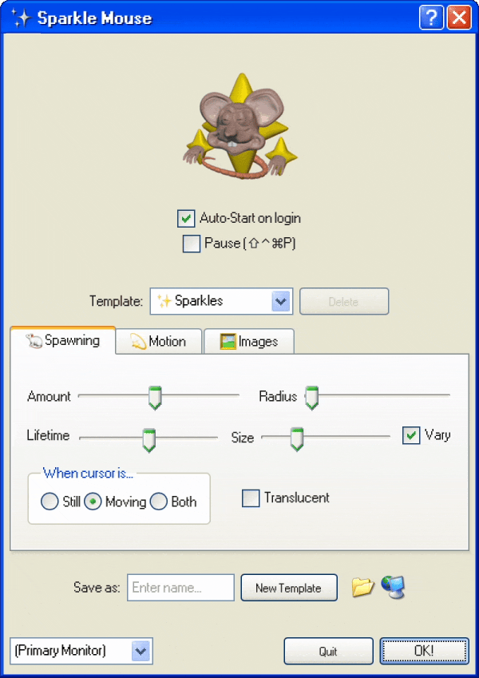
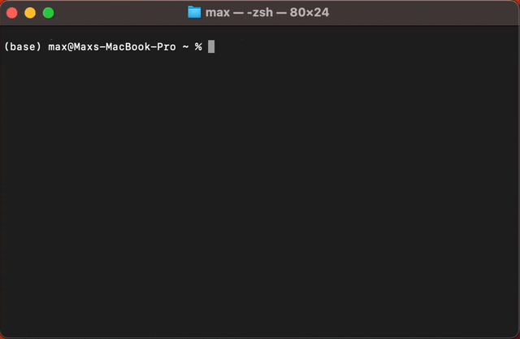
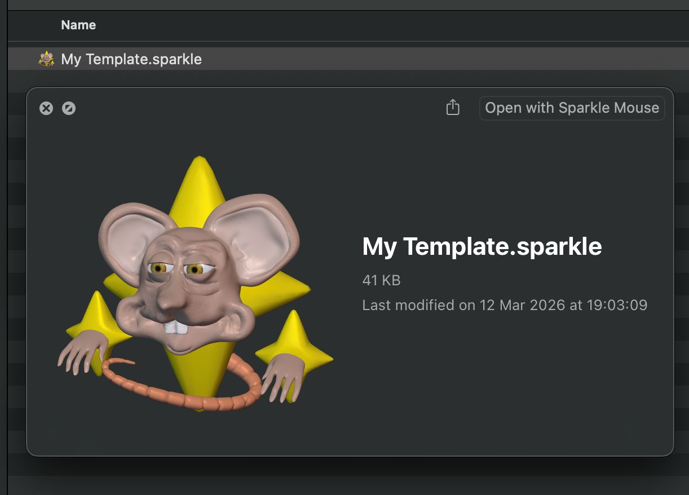

<div align="center">

<br>
<i><small>logo by <a href="https://livicg.co.uk">Livi Wilmore</a></small></i>
<br><br>


# ✨ Coming soon! ✨


# Sparkle Mouse
### Cute Customizable Particles! 🐁✨
GPU optimized sparkles for Windows + Mac + Web
<br>Tauri 2.0 App & JS Package
<br>Made with Three.js

[](https://www.sparklemou.se)

<br><b>Video!</b><br>
[](https://www.youtube.com/watch?v=I9LLf8ShzNA)

</div>

- The sparkle-mouse JS package is 100% free. Use it on your website!

- The desktop app is open-source. Please buy the installer from [itch.io](https://maxvanleeuwen.itch.io/sparkle-mouse) to support development! Thank you :)

<br>

## What Can It Do?

Sparkle Mouse brings that nostalgic webcore aesthetic to your desktop or website. It renders customizable particles next to you cursor, or full-screen.

<br>

<br><i>(the UI looks like Windows XP :P)</i>
<br><br>

Your sparkle settings are stored as <i>.sparkle</i> template files! Share them with friends between desktops, or use them on a web installation of Sparkle Mouse.

I optimized the particles to run fully on the GPU, even with many different GIFs it runs pretty smooth!

<br>


<i>Flower GIFs from GeoCities are playing on each particle, get the template [here](https://maxvanleeuwen.itch.io/webcore-fish-sparkle-template)!</i>

<br>

The desktop app can be controlled through HTTP API and CLI (get started: `sparkle-mouse -h`) in case you want to connect it to your own apps or scripts. 



For example, run `sparkle-mouse --headless template.sparkle` to start the app with a template file, without showing the UI.

<br>


See [this](https://github.com/max-van-leeuwen/sparkle-mouse/tree/main/examples) python example to learn how to draw shapes, using the HTTP API.
<br>

<br>

## .Sparkle Files?

<br> 



<br>
These are templates! Containing all sparkle settings.

Double-click to open. When placed in the templates folder, the desktop app automatically shows it in its templates list.
But these files can also be used on web, or with CLI.

It's a JSON file containing all settings + image data (base64 and/or built-in image identifier). 

Find the default sparkle template [here](readme-media/Sparkles.sparkle)!

<br>

## Repo Contents
This repo contains:
1. Tauri 2.0 desktop app (Mac + Win)
2. [npm package](https://www.npmjs.com/package/sparkle-mouse?activeTab=readme): sparkle-mouse

    ```bash
    # install using one of these:
    npm install sparkle-mouse
    yarn add sparkle-mouse
    pnpm add sparkle-mouse
    ```
3. The [bundled package](https://github.com/max-van-leeuwen/sparkle-mouse/tree/main/examples/bundled-package), for self-hosted sites like Neocities!

<br>

## Local Build
```bash
# mac
npm run build:mac

# mac notarized, see .config.env
npm run build:macnotarized

# windows
npm run build:win

# linux
npm run build:linux

# these automatically generate attribution.txt

# on mac, dmg is packaged twice:
# 1st time to let tauri generate bundle_dmg.sh
# 2nd time to bundle after plist modification
```

<br>

## Test Run
```bash
# test
npm run test

# test headless
npm run test:headless

# quick version setter (package.json, Cargo.toml, etc)
npm run set-version 1.0.5

# test CLI
npm run build:macnotarized # or other platform
./src-tauri/target/release/sparkle-mouse --headless --size=0.5 --amount=0.8

# simulate github actions build variant (replace "+1" with: +1 standard, +2 unlicensed, +3 steam, +4 steam-unlicensed)
sed -i '' -E 's/"version": "([0-9]+\.[0-9]+\.[0-9]+)"/"version": "\1+1"/' src-tauri/tauri.conf.json
npm run test
git checkout -- src-tauri/tauri.conf.json # always revert when done!

# clear cache, reinstall
npm run clean
```

<br>

## Linux? (X11)
Linux is not supported. But I got pretty far! Give it a shot if you're feeling adventurous.

```
# force GPU on linux and run:
DRI_PRIME=1 npm run test
```

On Fedora/vanilla GNOME, the tray icon requires the AppIndicator extension. This is suggested by the RPM package on install:
```bash
sudo dnf install gnome-shell-extension-appindicator
gnome-extensions enable appindicatorsupport@rgcjonas.gmail.com
```

<br>

## Support this project
If you like this project and want to support it, please consider buying the [executable](https://maxvanleeuwen.itch.io/sparkle-mouse) or [donating](https://ko-fi.com/maxvanleeuwen)! :)